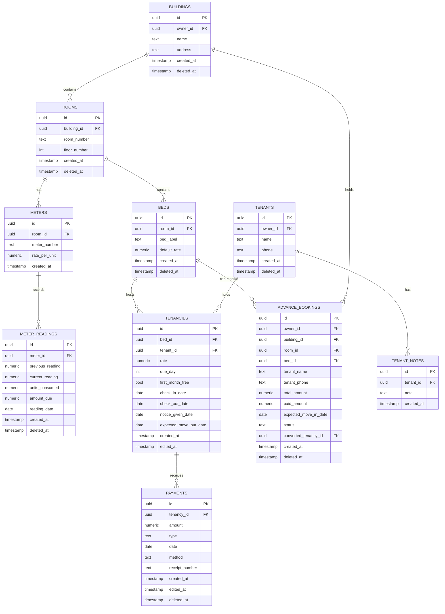

# Rent-Hive Architecture Specification

## 1. System Architecture Overview
**Rent-Hive** is built as a cloud-native, Progressive Web Application (PWA) using Next.js 16 App Router on the frontend and Supabase (PostgreSQL + Auth + Row Level Security) on the backend.

```
┌─────────────────────────────────────────────────────────────┐
│                 Client Layer (Next.js 16 PWA)                │
│  React 19 Server/Client Components · Tailwind CSS v4       │
│  Plus Jakarta Sans / Geist · Lucide Icons · Framer Motion   │
│  Service Worker Offline Cache · PWA Install Banners         │
└──────────────┬──────────────────────────────┬───────────────┘
               │ (HTTPS / Server Actions)     │ (Client SDK)
               ▼                              ▼
┌─────────────────────────────────────────────────────────────┐
│             Application Services & Middleware               │
│  Vercel Edge/Serverless · Supabase SSR Auth                 │
│  PostHog Analytics · Sentry Error Monitoring                │
└──────────────────────────────┬──────────────────────────────┘
                               │
                               ▼
┌─────────────────────────────────────────────────────────────┐
│                 Supabase Backend Services                    │
│  PostgreSQL 15+ (Relational Tables + convert_advance_booking)│
│  Row-Level Security (RLS) policies scoped to auth.uid()     │
│  Native deleted_at TIMESTAMPTZ Soft Delete on All Tables    │
│  Supabase Auth (JWT Email/Password)                         │
└─────────────────────────────────────────────────────────────┘
```

---

## 2. Technology Stack & Infrastructure

### 2.1 Core Stack
| Component | Technology | Rationale & Constraint |
|---|---|---|
| **Framework** | Next.js 16.3.1 (React 19, App Router) | Fast server-side rendering, streaming UI, Server Actions |
| **Language** | TypeScript 5 | Full end-to-end type safety |
| **Styling** | Tailwind CSS v4 (`@tailwindcss/postcss`) | CSS-variable driven design system, zero-runtime tokens |
| **Database & Auth** | Supabase (PostgreSQL + Auth) | Direct compatibility with RENT-GRID live schema and RLS |
| **Icons** | Lucide React | Crisp, stroke-based vector icons (NO emojis) |
| **Font Family** | Plus Jakarta Sans (or Geist) | Clean geometric sans-serif (Inter and Space Grotesque are strictly banned) |
| **Hosting** | Vercel (Free Tier) | Automatic CI/CD deployments from GitHub |
| **VCS** | GitHub | Version control and pull request workflow |
| **Email** | Resend | Transactional notifications/receipts (confirm use cases before wiring) |
| **DNS / CDN** | Cloudflare | Edge SSL, caching & security (when custom domain is configured) |
| **Product Analytics** | PostHog | Privacy-friendly product usage analytics |
| **Error Monitoring** | Sentry (`@sentry/nextjs`) | Real-time crash diagnostics and performance tracing |

### 2.2 Stack Boundary Constraints
- **NO Clerk Auth**: Authentication is exclusively handled by Supabase Auth (`@supabase/ssr`).
- **NO Upstash Redis / Vector DB (Pinecone)**: Out of scope for MVP; PostgreSQL indexing and caching provide sub-50ms query responses.
- **NO Client-side Payment Gateways**: Payments are recorded internally by property owners.

---

## 3. Data Model & Database Schema

Supabase PostgreSQL manages the relational data model. All tables enforce Row-Level Security (RLS) linked to `auth.uid()`. All entity tables include a native `deleted_at` timestamp column for unified cross-device soft deletion.



### 3.1 Bed Status State Machine
Bed status is dynamically computed from active database associations:
1. **Occupied**: Bed has an active tenancy (`check_out_date IS NULL` and tenant `deleted_at IS NULL`).
   - If `notice_given_date` or `expected_move_out_date` is set, displays sub-state **Moving Out Soon**.
2. **Reserved**: Bed is attached to an active advance booking (`status = 'pending'`, `bed_id = bed.id`, `deleted_at IS NULL`). Displayed with Deep Teal badge (`#007A78` / `#2DD4BF`).
3. **Vacant**: Bed has neither an active tenancy nor a pending advance booking.

### 3.2 PostgreSQL Stored Procedures / RPC
- `public.convert_advance_booking`: Atomic, idempotent transaction that locks the booking row (`FOR UPDATE`), validates pending status, verifies bed building ownership, creates tenant & tenancy records, applies advance payment as a rent credit (`payments`), and marks booking status as `converted` in a single ACID commit.

---

## 4. Navigation & Layout Architecture

### 4.1 Responsive App Shell
- **Desktop Viewport ($\ge 1024\text{px}$)**:
  - Fixed Collapsible Sidebar containing:
    - App Logo & Title
    - Global Building Switcher Dropdown
    - Primary Navigation: Dashboard (`/`), Tenants (`/tenants`), Electricity (`/electricity`), Payments (`/payments`), Buildings & Rooms (`/buildings`), Reports (`/reports`), Trash (`/trash`)
    - User Profile & Dark/Light Theme Toggle
- **Mobile Viewport ($< 1024\text{px}$)**:
  - Top App Bar: Logo, Active Building Context, Quick Search (`/search`), Profile/Settings (`/profile`).
  - Persistent Bottom Navigation Bar (3 Primary Destinations):
    1. **Dashboard** (`/`)
    2. **Tenants** (`/tenants`)
    3. **Electricity** (`/electricity`)
  - Sub-views (Rooms, Beds, Tenant History, Payments, Reports, Trash) pushed as stacked sub-pages with top back-navigation.

### 4.2 Route Sitemap
```
/login                              # Auth Login & Signup screen
/                                   # Dashboard (Hero metrics, quick actions, advance bookings, move-outs)
/search                             # Dominant room search & directory
/buildings                          # Buildings list & building management
/buildings/[buildingId]/rooms       # Rooms list for selected building
/rooms/[roomId]/beds                # Bed management hub & dialogs (Vacant, Reserved, Occupied)
/tenants                            # All tenants list (scoped to building)
/tenants/[tenantId]/history         # Comprehensive Tenant Hub (profile, dues, stay & payment history)
/electricity                        # Electricity & meter reading logger
/payments                           # All payments ledger with filters & totals
/reports                            # Collected/pending metrics (incl. electricity) & CSV exporter
/profile                            # Settings, profile, theme mode switcher
/trash                              # Unified DB soft-deleted items recovery & permanent purge
/dashboard/checked-in               # Checked-in tenants & awaiting check-in list
/dashboard/checked-out              # Move-outs & historical checkout window
/dashboard/empty-beds               # Global/building vacant bed browser
/dashboard/pending-balance          # Tenant pending dues drilldown
```

---

## 5. PWA Architecture & Mobile Web Strategy

### 5.1 Service Worker & Offline Caching Strategy
1. **Cache-First (Static Assets)**: Next.js pre-rendered chunks, Google fonts (Plus Jakarta Sans), CSS bundles, and static UI icons are aggressively cached in the CacheStorage API.
2. **Network-First with Stale-While-Revalidate (Supabase Reads)**: Read queries fallback to local cache when network connectivity is lost, displaying an amber "Offline — viewing cached data" banner.
3. **Optimistic UI with Write Protection**: Data mutations (check-ins, payments, readings) require an active internet connection or queue with instant feedback to prevent out-of-sync financial conflicts.

### 5.2 Per-Platform Install Prompts
- **Chromium / Android**: Listens to the `beforeinstallprompt` event; renders an un-intrusive "Install Rent-Hive App" button in the navigation header and Profile screen.
- **iOS Safari**: Since WebKit does not emit install events, a tailored helper modal guides users: *"Tap the Share button <span class="share-icon" /> and select 'Add to Home Screen' <span class="plus-icon" />"*.

### 5.3 iOS Safari Known Limitations & Mitigations
- **No Native Install Banner**: Handled via custom educational modal.
- **WebKit 7-Day Storage Eviction (ITP)**: If the PWA is not opened within 7 days, Safari evicts non-persisted IndexedDB/localStorage. Mitigation: Core state is authoritative on Supabase PostgreSQL; auth tokens are refreshed via Secure Cookies.
- **Background Sync / Push Limits**: Real-time updates utilize Supabase Realtime WebSocket subscriptions while the app is active, avoiding unreliable background push triggers on iOS.

---

## 6. Security & Data Protection

### 6.1 Supabase Row Level Security (RLS)
- Every table has RLS enabled with policies checking `auth.uid() = owner_id` (or joined via building ownership).
- Direct client-side queries cannot read or mutate data belonging to other landlords.

### 6.2 Unified PostgreSQL Soft-Delete System
- All tables enforce soft deletion via `deleted_at TIMESTAMPTZ`.
- Migration script `supabase/migrations/20260816000000_unified_soft_delete_and_schema.sql` creates all columns and index backstops.
- Standard queries apply `WHERE deleted_at IS NULL`.
- Trash queries apply `WHERE deleted_at IS NOT NULL` scoped to `auth.uid()`.
- Device `localStorage` is never used for trash tracking.

---

## 7. State Management & Data Fetching Strategy
- **Server Data**: Next.js Server Components and React Server Actions paired with Supabase SSR client for data fetching.
- **Client Cache & Invalidation**: TanStack React Query (or SWR) for real-time optimistic updates, dialog submissions, and fast invalidations.
- **Global Context**:
  - `ActiveBuildingContext`: Stores active building ID in persistent `localStorage` and syncs across all views.
  - `ThemeContext`: Toggles between `light`, `dark`, and `system` modes using Tailwind CSS dark class.
